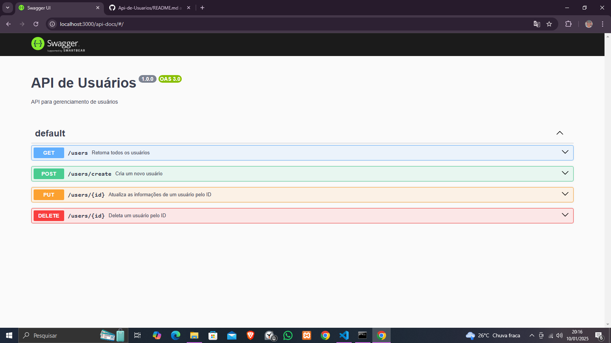

# Api-de-Usuarios
API para gerenciamento de usuários

## Instalação
Para instalar e rodar a API localmente:


```bash
git clone https://github.com/ithaloDev/Api-de-Usuarios.git
cd Api-de-Usuarios
npm install
npm start
```

## Endpoints
### GET /users/
Retorna todos os usuários.

### POST /users/create
Cria um novo usuário.

Body: { "user": "exemple234", "email": "example2322@example.com" }

### PUT /users/:id
Atualiza um usuário existente.

Body: { "user": "example25", "email": "example@example.com" }

### DELETE /users/:id
Exclui um usuário pelo ID.

### Swagger
A API possui documentação Swagger. Abaixo está uma imagem da api




